## Front-End Vanilla Script 예제 입니다.

## public 폴더에 html 과 export js 일부 파일 샘플이 있습니다.
## 사용 Lib. 는 node-modules 에서 복사된 라이브러리 입니다.
## package.json 과 같이 react, vue 등의 빌드 모듈과 사용 가능 합니다.
## 퍼블 소스를 거의 90% 이상 그대로 사용하며, Copilot, codex(ChatGPT) 기반으로 js 로 추출하여 로직으로 구현 합니다.
## API 호출은 fetch 를 사용하며, 바닐라 프레임웍의 특성 상 별도 jquery, AJAX 는 사용하지 않습니다.
## Middle Ware 로 Node JS Express 를 두고 Spring Boot 과 연동하는 경량화로 AWS EKS 기반으로 구축합니다.
## 기본 개발 산출물에서 Client 기반의 html 을 별도 추출 하여, js 분리 및 로직으로 구현 합니다.
## 당사의 대기업 및 공공기관 개발에서 제안하여 사용 사례가 다수 있습니다.

## Login 화면
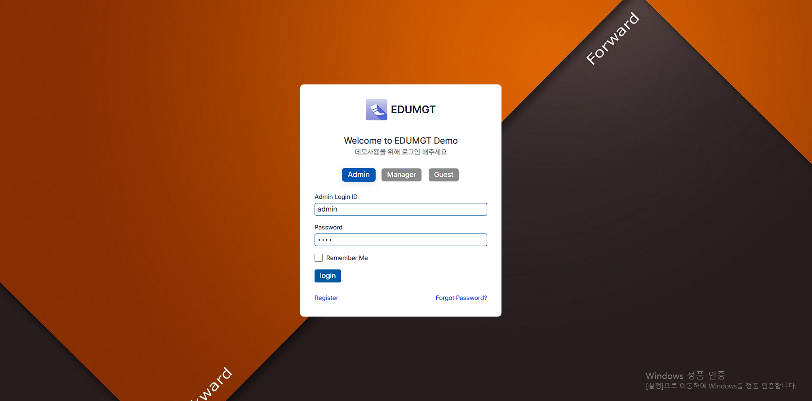

## tui Grid 사용 화면
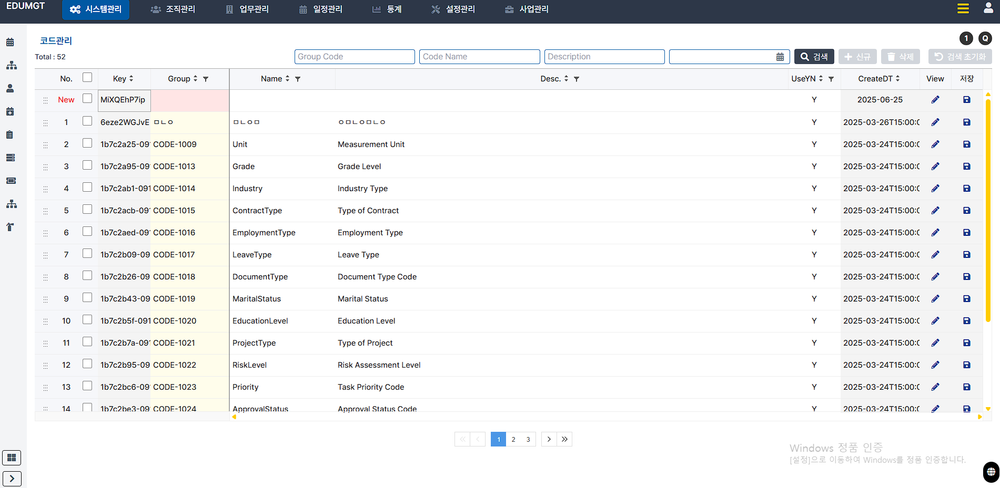

## 다국어 지원 화면
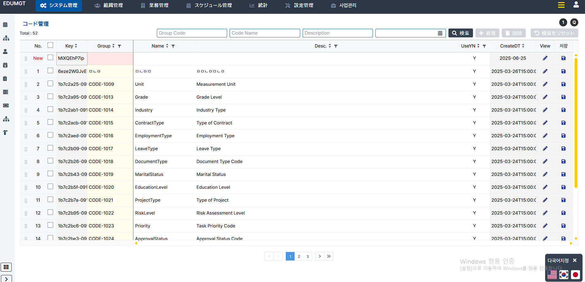

## 전체 메뉴 보기 화면
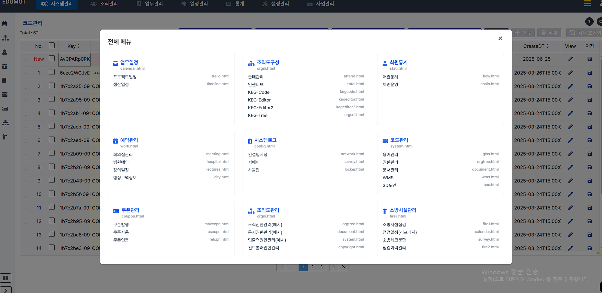

## 좌측 LNB 메뉴 클릭 화면
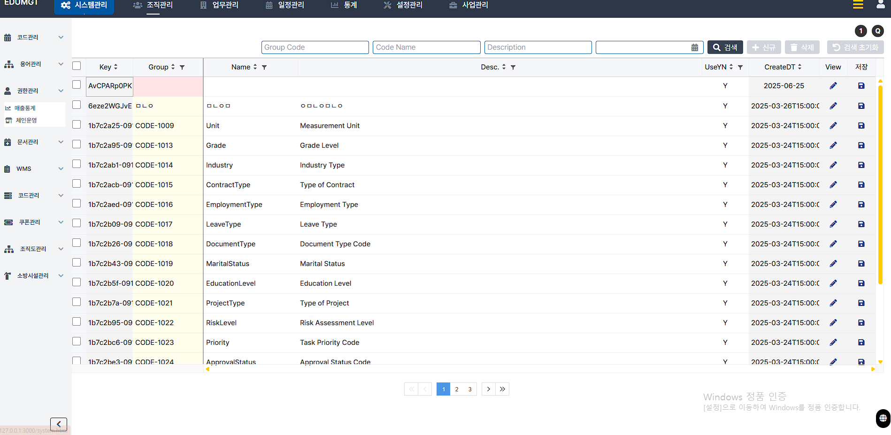

## 캘린더와 모달 팝업
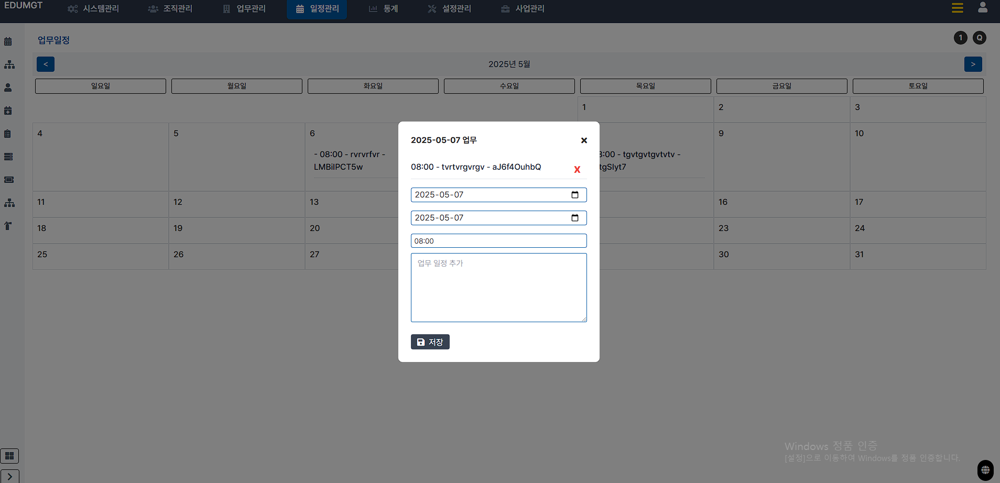

## Canvas 기반의 Drag and Drop 조직도
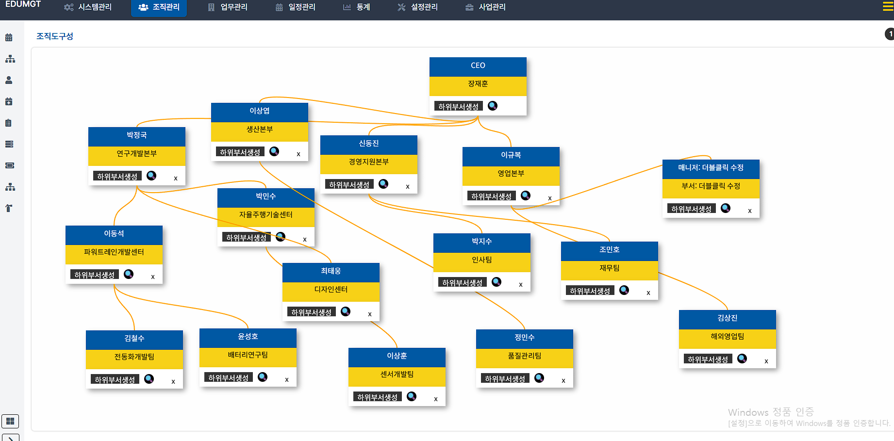

## 통집계, 로그 보기
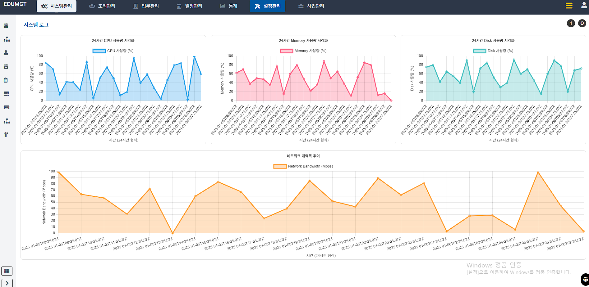
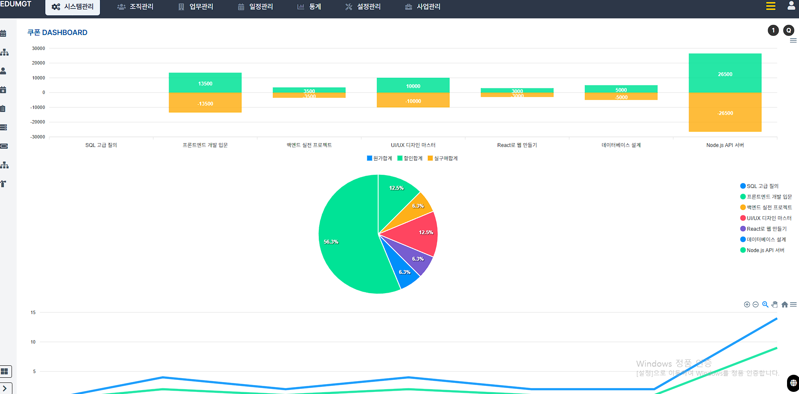

## 종이박스 3D 도안 예시
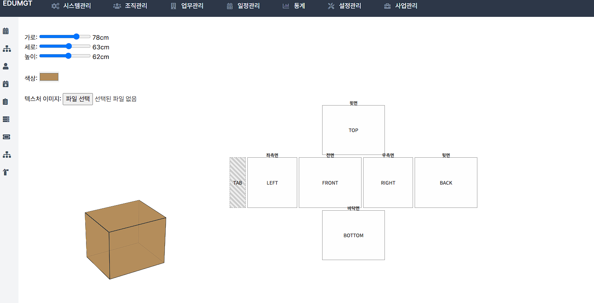

## 컨설팅 메모 화면 예시
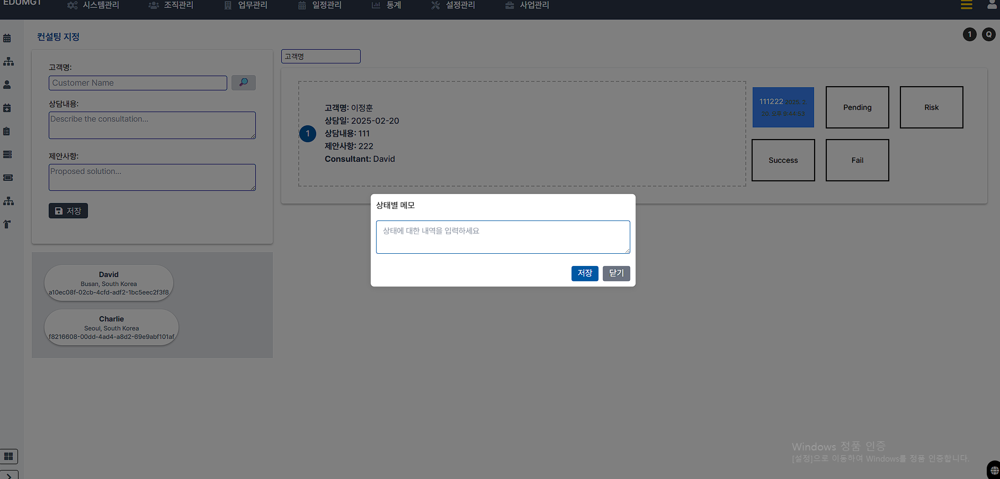

## 간트 차트 화면 예시
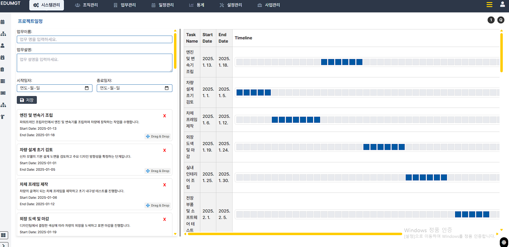

## 행정정보 기반 두 지역 간의 위치 예시
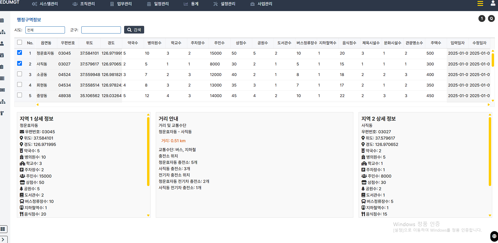

## 부서별 권한 관리
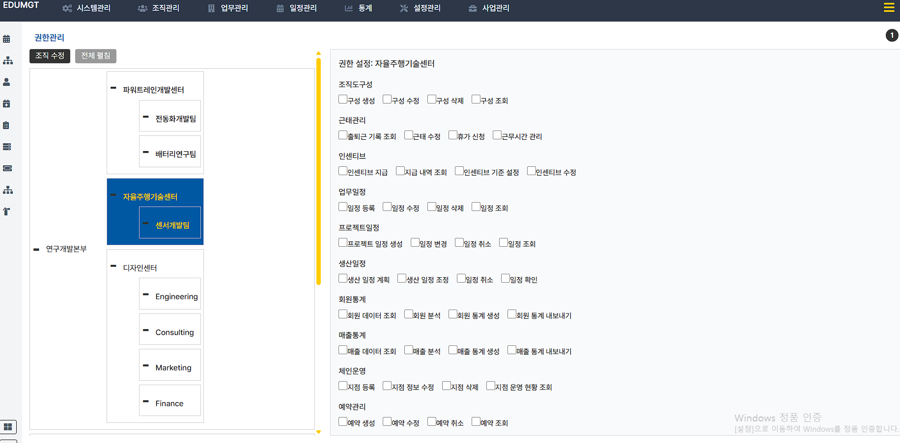

## Drag and Drop 기반 설문지 문항 조합
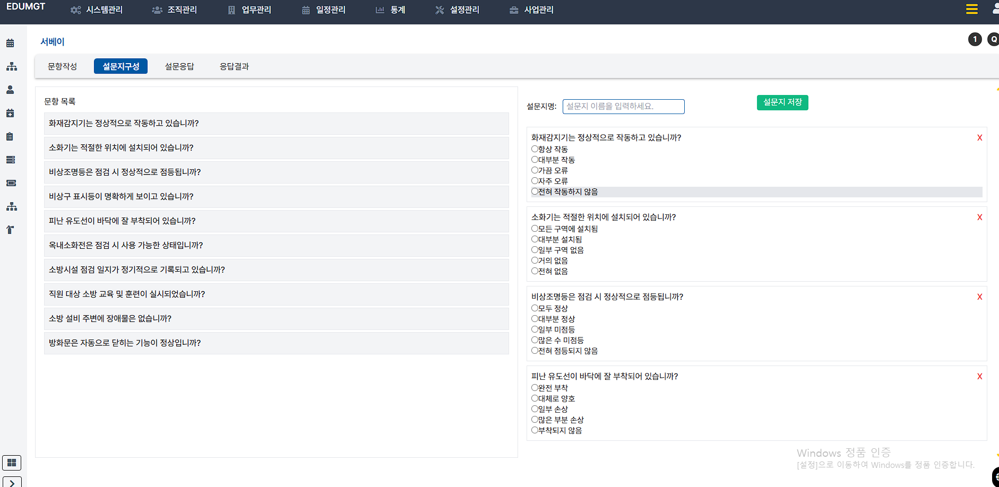

## 설문 결과 분포
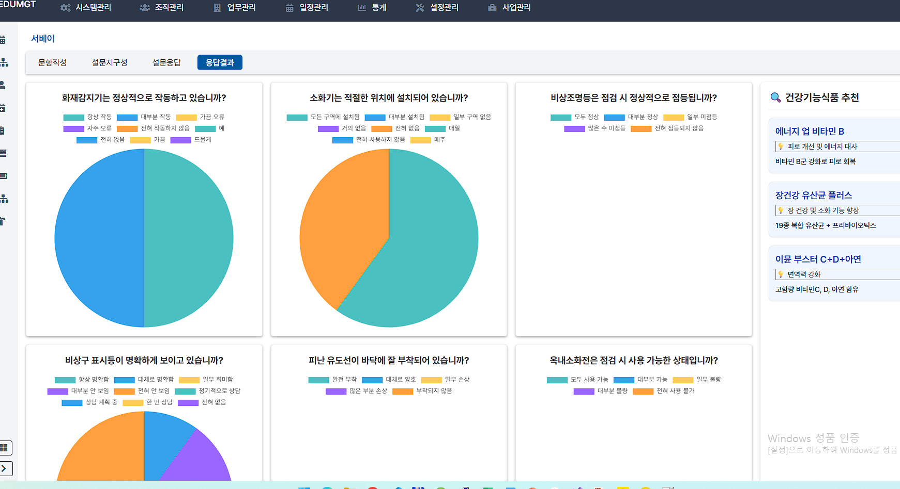

## Web Editor and 2개의 Grid간 데이타 이동
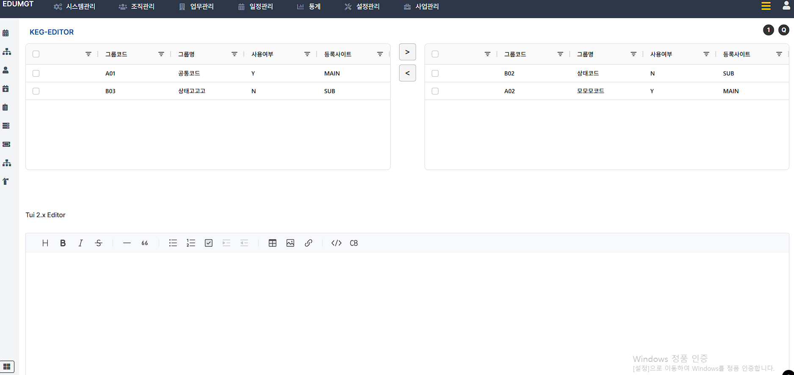

## 사물함 관리
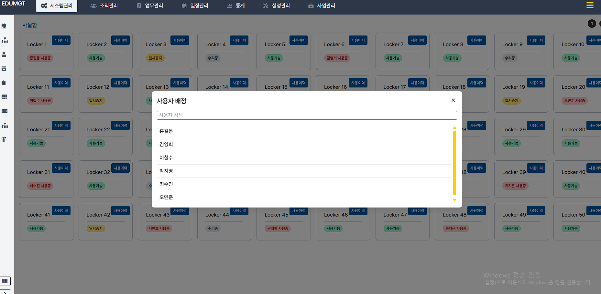

## 근태, 입출 이력
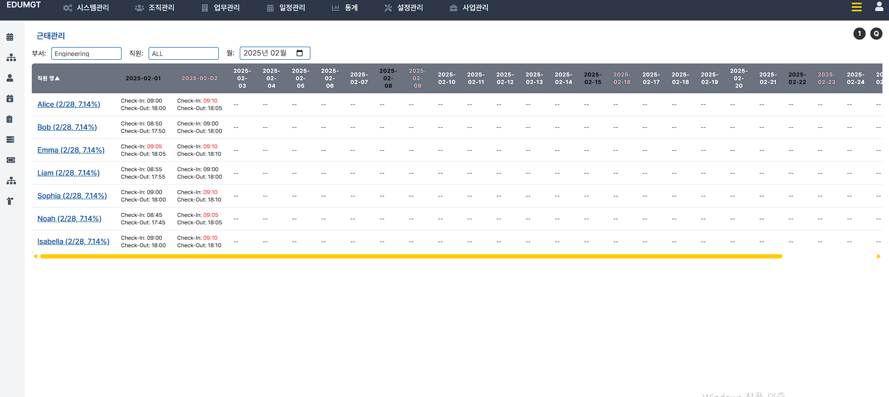
